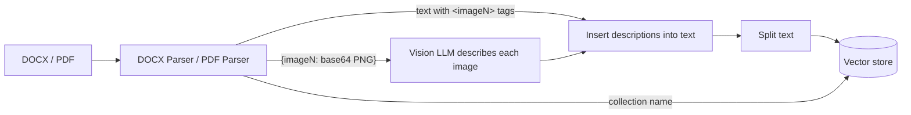

# Langflow Multimodal Parsers

[](https://github.com/Suuunboy/langflow-parsers/actions/workflows/ci.yml)


[](LICENSE)

Custom [Langflow](https://github.com/langflow-ai/langflow) components that turn **DOCX** and **PDF** files into
**text with image placeholders** plus a dictionary of **normalized PNG images**, ready for multimodal RAG.

## Why

Langflow's built-in File component extracts plain text only. Screenshots, diagrams and photos are dropped,
and so is the information about *where* they were. In technical manuals, specs and reports those images
often carry the most important content.

These parsers keep the position of every image as an `<imageN>` tag and return the images separately. A
vision model can then describe each image, and the description can be inserted exactly where the picture
was, before the text is chunked and indexed.

## How it works



For example, a DOCX with a heading, a paragraph, a screenshot and a table with an icon inside a cell
produces:

**Text output**

```text
Router setup guide
Connect the cables as shown below:
<image1>
| Port | Purpose |
| --- | --- |
| WAN | Uplink to the provider <image2> |
```

**Images output**

```json
{
  "image1": "iVBORw0KGgoAAAANSUhEUgAAAoAAAAHg...",
  "image2": "iVBORw0KGgoAAAANSUhEUgAAAMgAAABk..."
}
```

## Features

| | DOCX Parser | PDF Parser |
|---|:---:|:---:|
| Text in reading order with `<imageN>` placeholders | ✅ | ✅ |
| Tables rendered as Markdown (including images inside cells) | ✅ | — |
| Hyperlink text | ✅ | ✅ |
| Headers and footers (optional) | ✅ | — |
| DrawingML and legacy VML images | ✅ | — |
| EMF/WMF vector diagrams rasterized to PNG via LibreOffice | ✅ | — |
| Floating images without an inline anchor are kept | ✅ | — |
| All images normalized to RGB PNG (transparency flattened, CMYK and grayscale converted) | ✅ | ✅ |
| Repeated images (logos) deduplicated under one tag | ✅ | ✅ |
| Tiny images (icons, bullets) filtered by size | ✅ | ✅ |
| Two-column reading order (optional) | — | ✅ |
| Parsed once per run, shared by all outputs | ✅ | ✅ |

## Components

### Inputs

| Input | Component | Default | Description |
|---|---|---|---|
| **DOCX Data / PDF Data** | both | — | `Data` with the path to the file (see [Input contract](#input-contract)). |
| Min Image Size (px) | both | `50` | Images with width or height below this value are skipped. `0` keeps everything. |
| Include Headers and Footers | DOCX | `false` | Prepend page headers and append page footers to the text. |
| Reading Order | PDF | `Top to bottom` | `Two columns` reads the left column before the right one. |

### Outputs

| Output | Type | Content |
|---|---|---|
| Text with image tags | `Data` | `{"filename": "<flow_id>/<file>", "text": "..."}` |
| Images dict | `Data` | `{"value": {"image1": "<base64 PNG>", ...}}` |
| Collection name | `str` | `collection_name` passed through from the input, `""` if absent |

### Input contract

The input `Data` must carry the file path in one of two fields:

- `value`: a list of paths, as produced by a custom loader component (only the first path is parsed);
- `file_path`: a single path, as produced by Langflow's built-in **File** component.

An optional `collection_name` is passed through to the *Collection name* output, which is handy for
routing each document to its own vector store collection.

```python
Data(data={'value': ['/app/data/<flow_id>/manual.docx'], 'collection_name': 'manuals'})
```

## Installation

### Requirements

- Langflow 1.x
- `python-docx>=1.1`, `pymupdf>=1.24.3` and `pillow>=10` in the Python environment Langflow runs in
- *Optional:* LibreOffice (`soffice` on `PATH`), only needed to rasterize EMF/WMF diagrams in DOCX files.
  Without it such images are skipped and a warning is written to the component log.

### Option 1: load the components folder (recommended)

```bash
git clone https://github.com/Suuunboy/langflow-parsers.git
pip install "python-docx>=1.1" "pymupdf>=1.24.3" "pillow>=10"
LANGFLOW_COMPONENTS_PATH=./langflow-parsers/components langflow run
```

In Docker, mount the folder and point `LANGFLOW_COMPONENTS_PATH` at it:

```bash
docker run -p 7860:7860 \
  -v "$(pwd)/components:/app/custom_components" \
  -e LANGFLOW_COMPONENTS_PATH=/app/custom_components \
  langflowai/langflow:latest
```

Both components appear in the sidebar under the **parsers** category.

### Option 2: paste the code

Each component is a single self-contained file. Add a **Custom Component** to your flow, open its code
editor and replace the contents with [`docx_parser.py`](components/parsers/docx_parser.py) or
[`pdf_parser.py`](components/parsers/pdf_parser.py).

## Limitations

- **One file per run.** If the input contains several paths, only the first one is parsed and a warning is
  logged.
- **DOCX:** automatic list numbering and bullets are not included, because Word generates them at
  render time and they are not part of the document text. Text inside text boxes and shapes, footnotes
  and comments is not extracted; native Word charts are not rendered.
- **PDF:** scanned documents have no text layer and need OCR, which is not included. Vector graphics drawn
  with paths (e.g. charts) are not captured as images. Tables come out as plain lines of text. The
  two-column mode is a heuristic for classic two-column layouts.
- Images are returned as base64 strings, so large documents produce large payloads.

## Development

The project uses [uv](https://docs.astral.sh/uv/):

```bash
uv sync                          # create .venv with runtime and dev dependencies
uv run pytest --cov              # run the tests with coverage
uv run ruff check .              # lint
uv run ruff format .             # format
```

The tests do not need Langflow: [`tests/conftest.py`](tests/conftest.py) provides lightweight stand-ins for
the few Langflow classes the components use, and the real classes are used automatically when Langflow is
installed. Test documents are generated on the fly with python-docx and PyMuPDF, so the repository has no
binary fixtures.

### Project structure

```text
langflow-parsers/
├── components/
│   └── parsers/              # Langflow category folder (LANGFLOW_COMPONENTS_PATH points to components/)
│       ├── __init__.py
│       ├── docx_parser.py
│       └── pdf_parser.py
├── tests/
│   ├── conftest.py           # Langflow stubs and shared helpers
│   ├── test_docx_parser.py
│   └── test_pdf_parser.py
├── .github/workflows/ci.yml  # ruff + pytest on Python 3.10–3.13
├── pyproject.toml
└── uv.lock
```

## License

[MIT](LICENSE)
